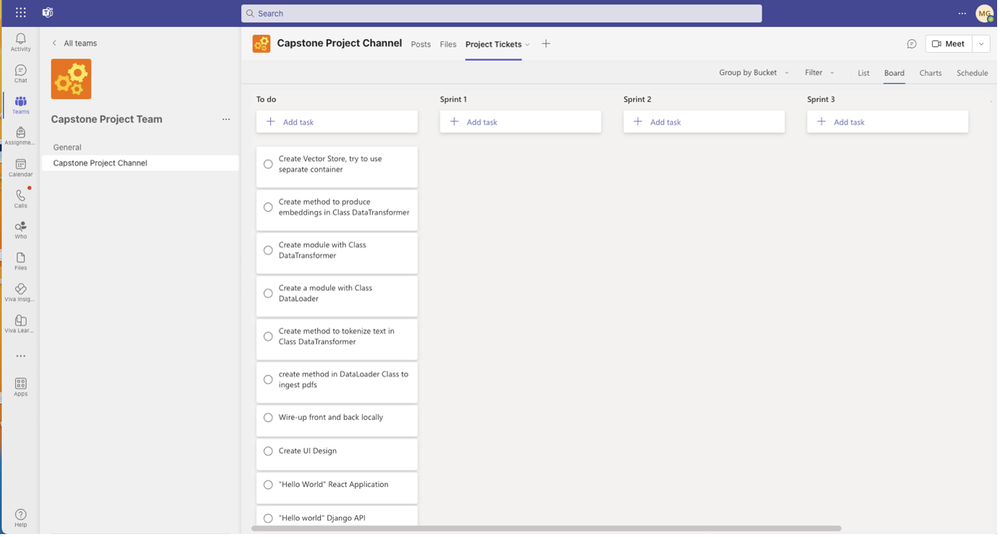
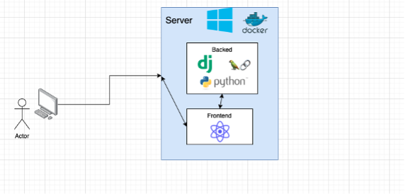
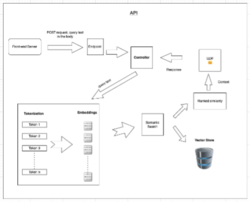
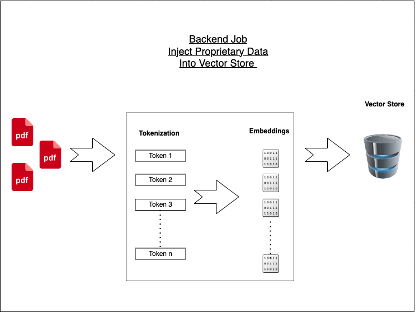
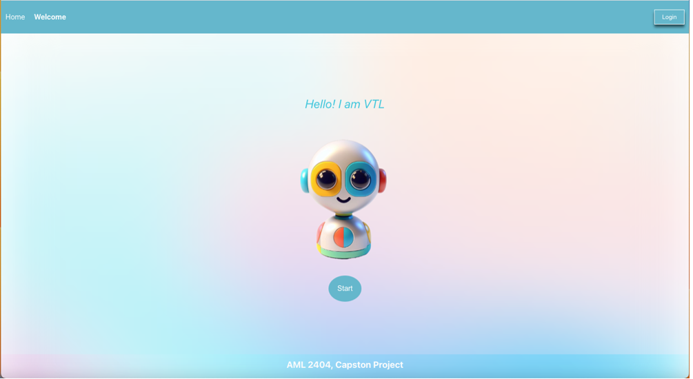
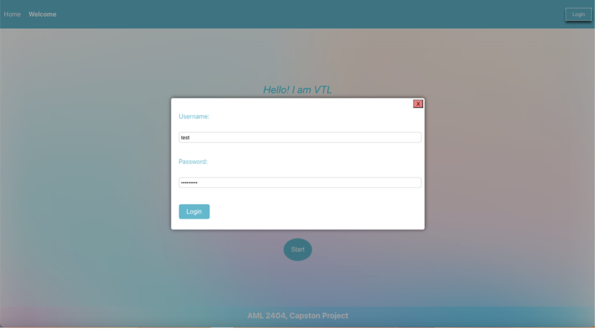
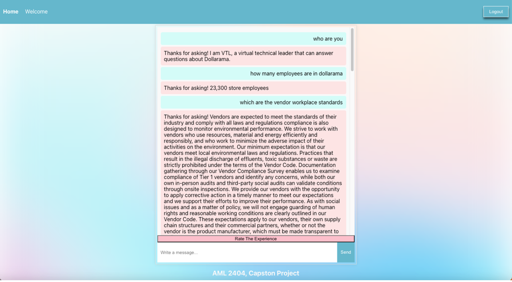
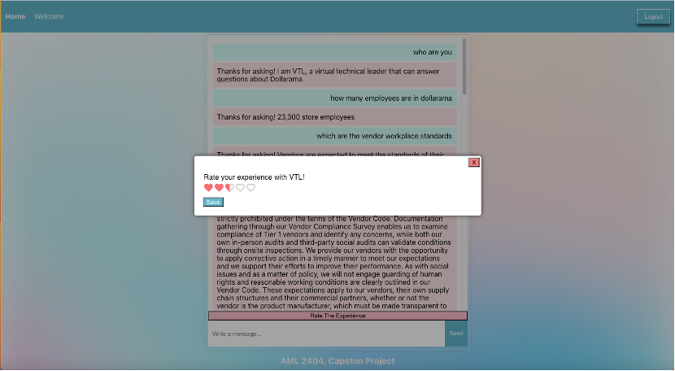

# AIML_Capstone_Project (Virtual Technical Leader VTL)

## Abstract

VTL is an AI (Artificial Intelligence) entity that can be placed in every organization as a tool for knowledge discovery. The application loads company information as embeddings in a vector store to achieve this purpose. Later, it captures the user inputs and conducts a similarity search into the vector store, retrieving the most relevant embeddings (most relevant company information). Finally, the user query and the relevant embeddings (context) are passed to the Large Language Model. The model can then provide human-like responses related to the organization. 

Additionally, the application handles proper authentication of users' chat history and a rating system that allows future implementations to improve the system. Furthermore, the application was deployed in Azure using Docker containers, allowing easy access and scalability. Finally, we loaded data from Dollarama containing typical business-related information, such as internal definitions and procedures, for the proof of concept. However, the system was designed to be adapted to every single company. 

The systems perform satisfactorily, and the answers from VTL generally are coherent, human-like, and related to the asked topic. 

## Introduction

Companies generate vast amounts of information and knowledge in different forms, primarily distributed in diverse systems and handled by mostly obsolete applications using simple search systems, making it difficult to get the exact needed answers. This situation creates several areas for inefficiency in an organization. Firstly, unreachable information or knowledge means a considerable investment in producing and storing it is worthless. Secondly, the quantity and quality of decisions can be seriously impacted if the right know-how is not used. Thirdly, big corporations can have expensive teams working on the same thing. Finally, employees are less productive if they spend considerable time getting the necessary information.  

In this last regard, according to a 2012 McKinsey report, employees spent an average of 1.8 hours per day or 9.8 hours per week just looking for information. Therefore, it could be said that for every five employees, one only searches for information in the company without adding real value to the organization. Concerning this, we did a simple analysis to understand how much it could cost an organization to have the wrong mechanisms to manage the company's knowledge and information. Assuming an average salary of CAD 80,000 annually per employee, we determined that the cost for a company would be around CAD 20M per 1,000 employees. 

VTL aims to solve this issue as an Artificial Intelligence entity in the organizations. This role would act as a knowledge discovery system that every employee can contact when any question is related to the organization. Having the power of Natural Language Processing (NLP) and Large Language Models (LLM) will allow employees to have conversations related to company topics, which will reduce the time for employees to get the answers required for the job, make the onboarding process more straightforward, eliminate work duplications by having an easy understanding of what has already be done, and finally, will release time for the most specialized talent who will be able to focus more on strategic projects rather than answering routine questions. 

To fulfill this purpose, the applications include a script that automates the transformation of company information into embeddings and storage into a vector store. Additionally, the application uses a powerful LLM (Google’s flan-t5-xxl) to process the information and deliver human-like responses. Furthermore, VTL offers a user-friendly interface, an authentication system, and a rating modal to store the users' satisfaction rate.  

In conclusion, the discoverability of information and knowledge in an organization is critical, and having a lousy management system can create severe losses for an organization. Fortunately, VTL is here to handle information and knowledge in each organization efficiently. 

## Methods

### 1. Company Information: 

To prove the concept, we selected a specific company, Dollarama. The information was taken from the official website. The documents are in PDF format. 

### 2. Project Management: 

The team used the Agile methodology “Scrum” to guarantee incremental deliverables; the sprints were one week each, and the ceremonies were on Fridays during class 'time. In the ceremonies, we created new tasks and discussed what was done and pending for the next sprint. Additionally, we had critical decisions related to the technical stack, among others. 
 
The Initial board looked like the following: 



### 3. Project Architecture:

The application has a frontend server built on React and a backend server built in Django. We deployed the application in Azure using a Docker container. See Figure below.



#### 3.1 Backend Server:

The backend has the following endpoints:

- /admin: Allows admins to create users and to perform any other action on the databases.
- /login: Post request in which client provides username and password. The endpoint sets a  csrftoken which the client uses to authenticate further requests.
- /logout: The post handler here removes the csrftoken. Therefore, further requests from the client will be denied until the new login is done.
- /chat: The picture below shows the information flow to resolve a specific user query. As can be seen, the client (React Server) sends a post request to the backend API (Django Server), and the text in the query is transformed into embeddings and used to conduct a similarity search into the vector store (embeddings with company information). The result of the similarity search is passed as context to the model. Finally, the model provides a human-like answer that is later returned as a response to the client.



- /history: This endpoint has a get request to retrieve all user chat history and a post request to store new conversations.
- /rating: This endpoint admits a get request to resolve the user ratings and a post request to store new ratings.

#### 3.2 Backend Job:

The backend also contains a script to load company data into the vector store. This script can be attached to any task scheduler to automate information processing and load into the vector store.
The picture below shows how the script works:



The command to run the script is below:
```
CHROMA_PATH=VectorDB_path python ../load_embeddings.py chroma files_directory_path
```

### 5.	Vector Store:

We explored two different vector stores, Pinecone and ChromaDB. Pinecone stores vectors in the cloud and ChromaDB on disk. After setting up and testing the two options, we decided to move forward with ChomeDB as this last one gave more flexibility to explore than Pinecone, which allows just one vector store in the free account.

### 6.	Large Language Model:

We tested two LLM for this project:

- anakin87/zephyr-7b-alpha-sharded: This is a fine-tuned Llama (Meta) version available in Hugging Face. The answers from this model are remarkable. However, it is too large to use the Hugging Face free inference API. Therefore, we had to download and use the model with the local GPU. The answers from this model took 20 minutes on average. Consequently, we decided to do not to proceed with it.
- google/flan-t5-xxl: This model combines two; FLAN is a Finetuned Language Net, and T5 is a language model by Google; the model has been trained with 11B parameters. It delivers good answers and has the advantage that it can be used though the free inference API from Hugging Face, which helped us to get faster answers from the model. Therefore, we decided to move ahead with this one.

### 7.	Embeddings:

We explored two types of embeddings: Spacy Embeddings and Hugging Face
Embeddings. For this project, the last ones performed better.

### 8.	Relational Database:

We use an SQLite database to store users, chat history, and ratings.

## Results

### 1. Welcome Page:

The welcome page is the first view the app user will reach. The users must log in (upper right corner) to access the home page (chat). Below, there is a picture of the welcome page.



Once the user clicks the “Login” button, a modal will open so the user can add the credentials. See picture below:



In the current version, the administrator handles the credentials directly. Therefore, we did not create a registration page.

### 2. Home Page:

Once the user has logged in, the home page will show up. As seen in the picture below, the user will see a chat with the history of the previous chat, if there is any.



### 3. Rating the experience:

Users can chat with VTL on topics related to Dollarama (the Company selected for this proof of concept). The answers are correct in most cases, and the speed of the responses is very good. The user can rate the experience anytime by clicking “Rate the Experience.” A modal will open with options for the user to choose between 1 to 5. See the picture below:



The ratings are stored in the database for further application performance analysis.

## Conclusions and Future Work

VTL performs well at answering questions about a given company; in this project, we selected Dollarama. This proved that retraining an LLM with domain-specific information is not required to enable the model to answer on that domain. The strategy of passing the information as the context was valid and practical to meet the results.

Additionally, we assessed the impact of the embeddings in the results, concluding that this selection can highly influence the quality of the responses. Furthermore, we could pass a template to the model to shape the model responses.

Additionally, running a Llama 7B with anakin87/zephyr-7b-alpha-sharded CPU took 20 minutes on average in the responses. Therefore, for this project, the best option was to use the free inference API from Hugging Face; with this option, we could reduce the response time to less than a second.

Future work on VTL would aim to conduct several prompt engineering strategies to improve the performance of the LLM model and the overall application:

- For instance, a better answer format could include the exact name of the document used, the page where the answer is located, and a link to it.

- The application should allow users to clean up the space by deleting the chat history or creating a new chat.

- Regarding performance, we could summarize the context before passing it to the model. Additionally, using techniques such as self-reflection allows the model to consider and improve its outputs. Furthermore, we would use the rating information to perform analytics and find poor and good performance patterns. Finally, we could create an experimental design to test different embedding methods and models, as we saw in this work; those significantly impact the quality of the result.


## References

- Hugging Face Documentation. zephyr-7b-alpha-sharded. Retrieved from https://huggingface.co/anakin87/zephyr-7b-alpha-sharded

- Hugging Face Documentation. Flan-t5-xxl. Retrieved from https://huggingface.co/google/flan-t5-xxl

- ProProfts (2019, July 19th). Does Your Workforce Spend Too Much Time Searching for Information? Retrieved from https://www.proprofskb.com/blog/workforce-spend-much-time-searching-information/#:~:text=According%20to%20a%20McKinsey%20report,average%E2%80%94searching%20and%20gathering%20information.
Xenit (2012, July). Do workers still waste time searching for information? Retrieved from https://xenit.eu/do-workers-still-waste-time-searching-for-information/

- McKinsey (2019, January). The social economy: Unlocking value and productivity through social technologies. Retrieved from https://www.mckinsey.com/industries/technology-media-and-telecommunications/our-insights/the-social-economy
